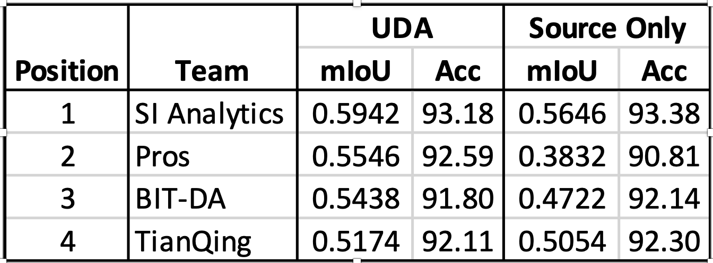

# VisDA 2022 Challenge

**[[Challenge website]](https://ai.bu.edu/visda-2022/)**

# BIT-DA solution - SePiCo

[](https://arxiv.org/abs/2204.08808)  [](https://github.com/BIT-DA/SePiCo)

final leaderboard


## Prepare
We use the provided dataset/pre-trained checkpoints without any additional datasets/checkpoints

The pre-trained folder should include `pretrained/mit_b5.pth`

The data folder should be structured as follows:
```
├── data/
│   ├── zerowaste-f/     
|   |   ├── train/
|   |   |   ├── data/
|   |   |   ├── sem_seg/
|   |   ├── val/
|   |   |   ├── data/
|   |   |   ├── sem_seg/
|   |   ├── test/
|   |   |   ├── data/
|   |   |   ├── sem_seg/
│   ├── zerowaste-v2-splits/
|   |   ├── train/
|   |   |   ├── data/
|   |   ├── val/
|   |   |   ├── data/
|   |   ├── test/
|   |   |   ├── data/
│   └──	
```

## Train & Evaluate
To train the model with a desired configuration, and produce final predictions in the original label mapping (0 = 'background', 1 = 'rigid_plastic', 2 = 'cardboard', 3 = 'metal', 4 = 'soft_plastic'), 
use the following script:
```shell
# STEP 1: Training
# To run an experiment, first set the parameters in `experiments.py` and take the exp id here
# The working directory is set to `./work_dirs_test`. Change it in run_experiments.py if you would like to.
## source only
python run_experiments.py --exp 0
## SePiCo, 3 random runs
python run_experiments.py --exp 1  

# STEP 2: Evaluate and do palette
# This step evaluates the model and outputs corresponding test set labels (zero v2 val/test set)
# Gets visuals here
## source only 
python -m tools.test CFG_PATH MODEL_PATH --show-dir ./PATH_TO_SHOW/exp0/palette --opacity 1
## ensemble sepico
python -m tools.ensemble_test CFG1_PATH CFG2_PATH CFG3_PATH --checkpoint MODEL1_PATH MODEL2_PATH MODEL3_PATH --show-dir ./PATH_TO_SHOW/exp1/palette --opacity 1 --ensemble-policy average_policy

# STEP 3: Converting for submission
# This step converts visual labels to train id labels to prepare for submission
python -m tools.convert_visuals_to_labels ./PATH_TO_SHOW/exp0/palette ./PATH_TO_SHOW/exp0/source_only
python -m tools.convert_visuals_to_labels ./PATH_TO_SHOW/exp1/palette ./PATH_TO_SHOW/exp1/uda


# STEP 4: Packing and zipping
zip -q -r sepico_v1_to_v2.zip ./PATH_TO_SHOW/exp1/uda ./PATH_TO_SHOW/exp0/source_only
```

## Baseline results
The baseline results on the test and validation sets of ZeroWaste V2 are as follows:
| Experiment            | test mIoU   |  test  Acc  |  val mIoU    |  val  Acc   |    #params  |
| -----------           | ----------- | ----------- |  ----------- | ----------- | ----------- |
| SegFormer V1          |     47.22   |     92.14   |    46.0      |   88.09     |   84.6 M    |
| SePiCo V1->V2         |     54.38   |     91.80   |    54.0      |    87.57    |   85.55M    | 


## Hardware and training and test time
We conducted all experiments on a single NVIDIA A100-SXM4-80GB, the training process costs about 14 hours (per run) and test process costs about 6 minutes (ensemble 3 runs).

## Citation
```
@article{xie2022sepico,
  title={SePiCo: Semantic-Guided Pixel Contrast for Domain Adaptive Semantic Segmentation},
  author={Xie, Binhui and Li, Shuang and Li, Mingjia and Liu, Chi Harold and Huang, Gao and Wang, Guoren},
  journal={arXiv preprint arXiv:2204.08808},
  year={2022}
}
```